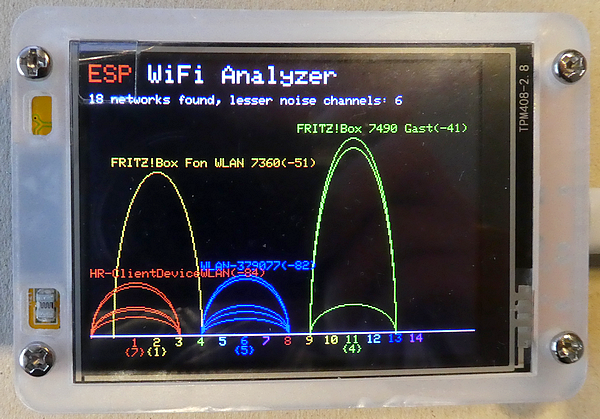
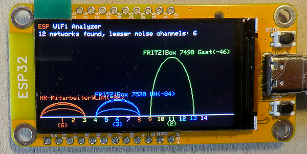
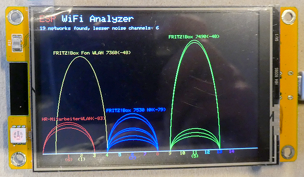

# ESP32 Cheap Yellow Display (CYD) Wi-Fi Analyzer

This is the accompanying repository for my article "**Use an ESP32 Cheap Yellow Device as graphical Wi-Fi Analyzer**" available here: 

For short - what is a "Cheap Yellow Display" ? This device was introduced some years ago and allowed for very fast development of projects where an ESP32, a TFT (optional Touch surface), an SD Card Reader and an RGB LED is included. The first version was equipped with a 2.8 inch large TFT display with **ILI9341** driver chip and **XPT2046** resistive Touch driver chip. Newer versions are sold with a **ST7789** display driver chip. Nowadays, the device is available with different display sizes (1.28 up to 7 inches) and driver chips, and for this project I'm using 1.9-inches variants The display has a resolution of **320 x 170** pixels in Landscape orientation. Most of the devices are driven by an ESP32 WROOM microcontroller, but I saw some others with an ESP32-S3 chip.



## Required Library
````plaintext
GFX library for Arduino Version 1.6.3, https://github.com/moononournation/Arduino_GFX
````



## Development Environment
````plaintext
Arduino IDE Version 2.3.6 (Windows)
arduino-esp32 boards Version 3.2.0 (https://github.com/espressif/arduino-esp32)
Board: ESP32 Dev Module
````


